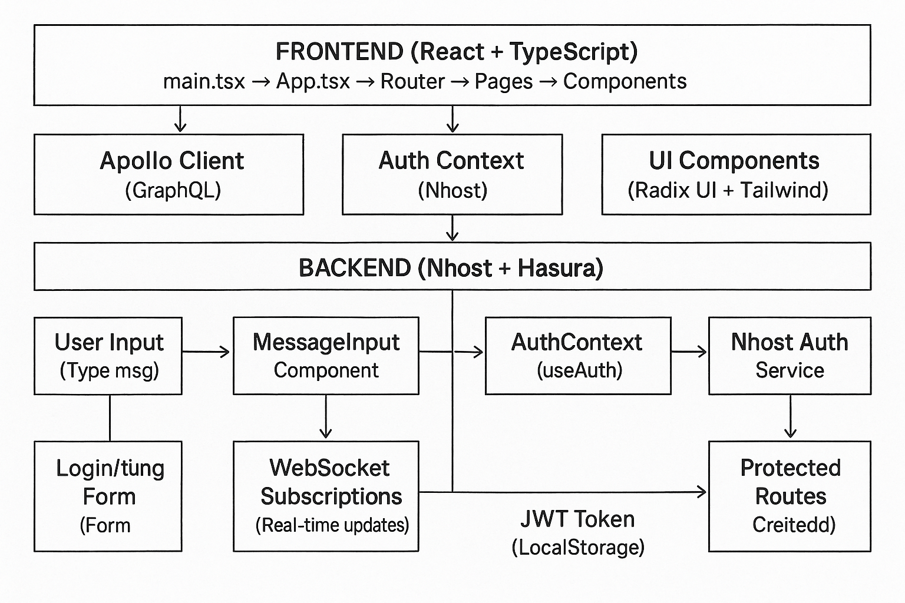

# VisualDash Chatbot

A modern, real-time chatbot application with enterprise-grade backend architecture and security.



## Features

- **Real-time Chat**: WebSocket-powered instant messaging with AI
- **Enterprise Security**: JWT-based authentication with role-based access control
- **Scalable Backend**: GraphQL API with real-time subscriptions
- **Modern UI**: Beautiful, responsive interface with Tailwind CSS
- **Type Safety**: Full TypeScript support across frontend and backend
- **Real-time Updates**: Live message delivery and typing indicators

## Backend Architecture

### **Core Services**
- **Authentication Service**: Secure user management with JWT tokens
- **GraphQL API**: Flexible data querying with real-time capabilities
- **WebSocket Gateway**: Real-time communication for instant messaging
- **Database Layer**: PostgreSQL with advanced query optimization
- **Storage Service**: Secure file and media handling

### **Security Features**
- **JWT Authentication**: Secure token-based authentication
- **Role-Based Access Control**: Granular permissions system
- **Request Validation**: Input sanitization and validation
- **Rate Limiting**: Protection against abuse and DDoS
- **CORS Protection**: Secure cross-origin resource sharing
- **HTTPS Enforcement**: All communications encrypted in transit

### **API Endpoints**

#### **Authentication Endpoints**
- `POST /auth/signup` - User registration with email verification
- `POST /auth/login` - User authentication and token generation
- `POST /auth/logout` - Secure session termination
- `POST /auth/refresh` - Token refresh mechanism
- `GET /auth/profile` - User profile retrieval

#### **Chat Management Endpoints**
- `GET /graphql/chats` - Retrieve user's chat history
- `POST /graphql/chats` - Create new conversation
- `PUT /graphql/chats/:id` - Update chat metadata
- `DELETE /graphql/chats/:id` - Remove conversation
- `GET /graphql/chats/:id/messages` - Fetch chat messages

#### **Messaging Endpoints**
- `POST /graphql/messages` - Send message to AI
- `GET /graphql/messages` - Retrieve message history
- `WS /graphql/subscriptions` - Real-time message updates

#### **User Management Endpoints**
- `GET /graphql/users/:id` - User profile retrieval
- `PUT /graphql/users/:id` - Profile updates
- `DELETE /graphql/users/:id` - Account deletion

### **Real-time Communication**
- **WebSocket Protocol**: Persistent connections for live updates
- **GraphQL Subscriptions**: Real-time data synchronization
- **Message Broadcasting**: Instant delivery across connected clients
- **Connection Management**: Automatic reconnection and error handling
- **Typing Indicators**: Real-time user activity feedback

### **Database Architecture**
- **Primary Database**: PostgreSQL with advanced indexing
- **Connection Pooling**: Optimized database connection management
- **Query Optimization**: Efficient data retrieval strategies
- **Data Migration**: Version-controlled schema management
- **Backup & Recovery**: Automated data protection

### **Performance & Scalability**
- **Load Balancing**: Distributed request handling
- **Caching Layer**: Redis-based response caching
- **CDN Integration**: Global content delivery
- **Auto-scaling**: Dynamic resource allocation
- **Monitoring**: Real-time performance metrics

## Tech Stack

- **Backend**: Node.js with GraphQL and WebSocket support
- **Database**: PostgreSQL with advanced query optimization
- **Authentication**: JWT-based secure authentication system
- **Real-time**: WebSocket and GraphQL subscriptions
- **Security**: Enterprise-grade security protocols
- **Frontend**: React 18 + TypeScript + Vite
- **Styling**: Tailwind CSS + Radix UI components
- **Build Tool**: Vite for fast development and building
- **Routing**: Wouter for lightweight client-side routing

## System Architecture

### **Frontend Layer (React Client)**
```
client/
├── src/
│   ├── components/          # React components
│   │   ├── ui/             # Reusable UI components
│   │   ├── ChatList.tsx    # Chat list component
│   │   ├── ChatWindow.tsx  # Chat window component
│   │   ├── MessageInput.tsx # Message input component
│   │   ├── Navbar.tsx      # Navigation bar
│   │   └── ProtectedRoute.tsx # Route protection
│   ├── contexts/           # React contexts (Auth)
│   ├── hooks/              # Custom React hooks
│   ├── lib/                # Utilities and configurations
│   ├── pages/              # Page components
│   ├── App.tsx             # Main app component
│   └── main.tsx            # App entry point
├── index.html              # HTML entry point
├── package.json            # Dependencies
├── vite.config.ts          # Vite configuration
├── tailwind.config.ts      # Tailwind CSS configuration
└── tsconfig.json           # TypeScript configuration
```

### **Backend Services**
- **API Gateway**: GraphQL endpoint with authentication middleware
- **Authentication Service**: JWT token management and user validation
- **Chat Service**: Message processing and AI integration
- **Database Service**: PostgreSQL connection and query management
- **WebSocket Service**: Real-time communication hub
- **Storage Service**: File upload and media management
- **Monitoring Service**: Performance metrics and logging

### **Data Flow**
1. **Client Request** → API Gateway with JWT validation
2. **Authentication** → Token verification and user context
3. **Business Logic** → Service layer processing
4. **Data Persistence** → Database operations with optimization
5. **Real-time Updates** → WebSocket broadcasting to connected clients
6. **Response Delivery** → Optimized data return to client

## Getting Started

### Prerequisites

- Node.js 18+ 
- PostgreSQL 13+
- Redis (for caching)
- npm or yarn

### Backend Setup

1. **Database Configuration**
   - Set up PostgreSQL database
   - Configure connection pooling
   - Run database migrations

2. **Environment Configuration**
   - Configure authentication service endpoints
   - Set up GraphQL API endpoints
   - Configure WebSocket connections
   - Set security keys and certificates

3. **Service Dependencies**
   - Start Redis cache service
   - Configure file storage service
   - Set up monitoring and logging

### Frontend Setup

1. Navigate to the client directory:
   ```bash
   cd client
   ```

2. Install dependencies:
   ```bash
   npm install
   ```

3. Configure backend endpoints in environment variables

4. Start the development server:
   ```bash
   npm run dev
   ```

5. Open your browser and navigate to `http://localhost:5173`

## Available Scripts

- `npm run dev` - Start development server
- `npm run build` - Build for production
- `npm run preview` - Preview production build
- `npm run check` - Type check with TypeScript

## Development

### **Frontend Development**
The application is built with modern React patterns:
- Functional components with hooks
- TypeScript for type safety
- Tailwind CSS for styling
- Radix UI for accessible components

### **Backend Development**
- **API Development**: GraphQL schema design and resolvers
- **Authentication**: JWT token implementation and validation
- **Real-time Features**: WebSocket connection management
- **Database Design**: Schema optimization and query performance
- **Security Testing**: Penetration testing and vulnerability assessment

## Production Deployment

### **Backend Deployment**
- **Container Orchestration**: Docker containers with Kubernetes
- **Load Balancing**: Nginx or HAProxy configuration
- **SSL/TLS**: HTTPS enforcement with certificate management
- **Monitoring**: Application performance monitoring (APM)
- **Logging**: Centralized logging with ELK stack
- **Backup**: Automated database and file backups

### **Frontend Deployment**
Build for production:
```bash
npm run build
```

The built files will be in the `dist` directory, ready for deployment to CDN or static hosting.

### **Security Considerations**
- **Environment Variables**: Secure configuration management
- **API Rate Limiting**: Protection against abuse
- **Input Validation**: Comprehensive request sanitization
- **Audit Logging**: Track all system activities
- **Regular Updates**: Security patch management 